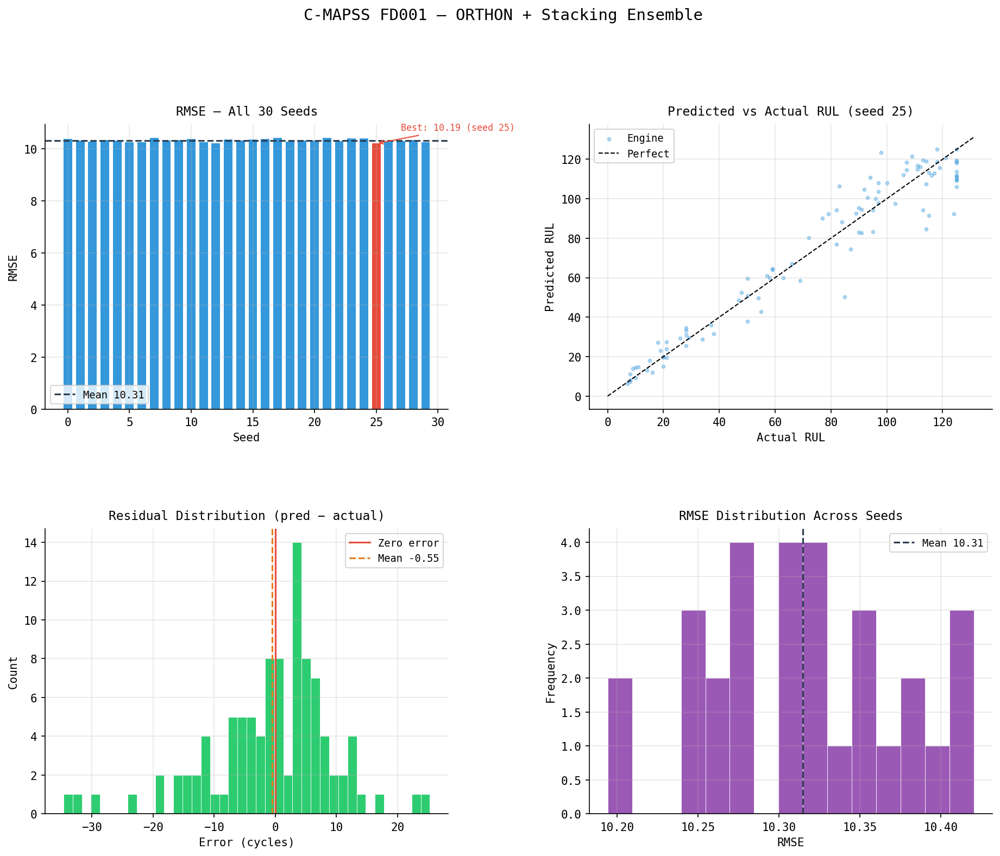
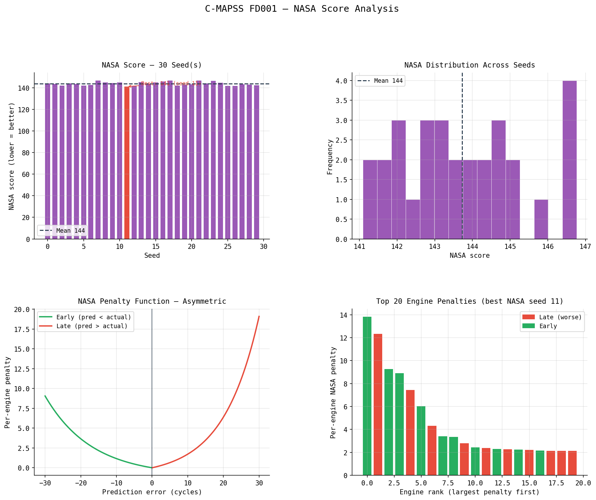
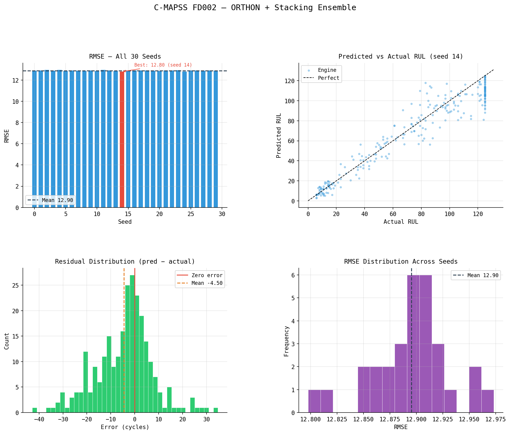
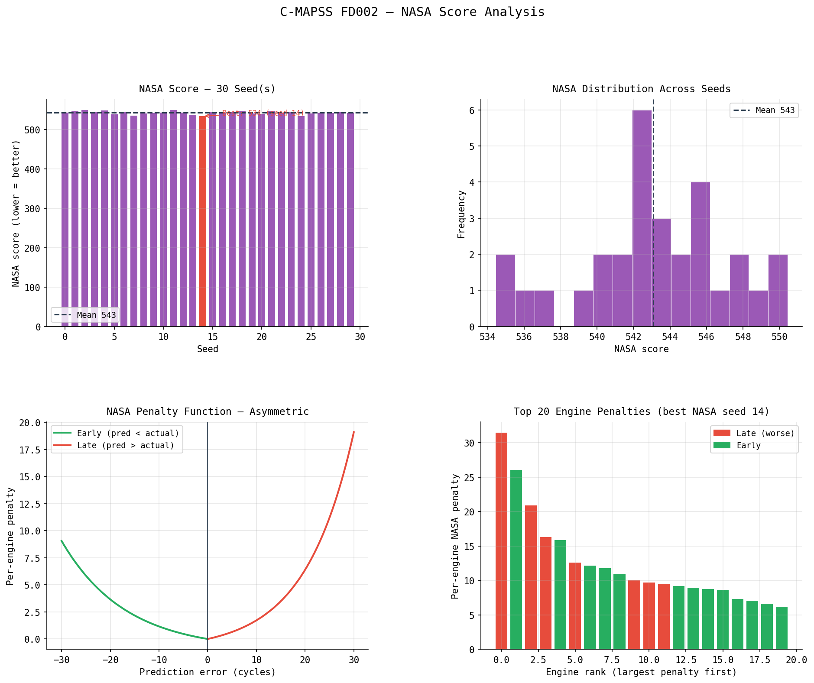
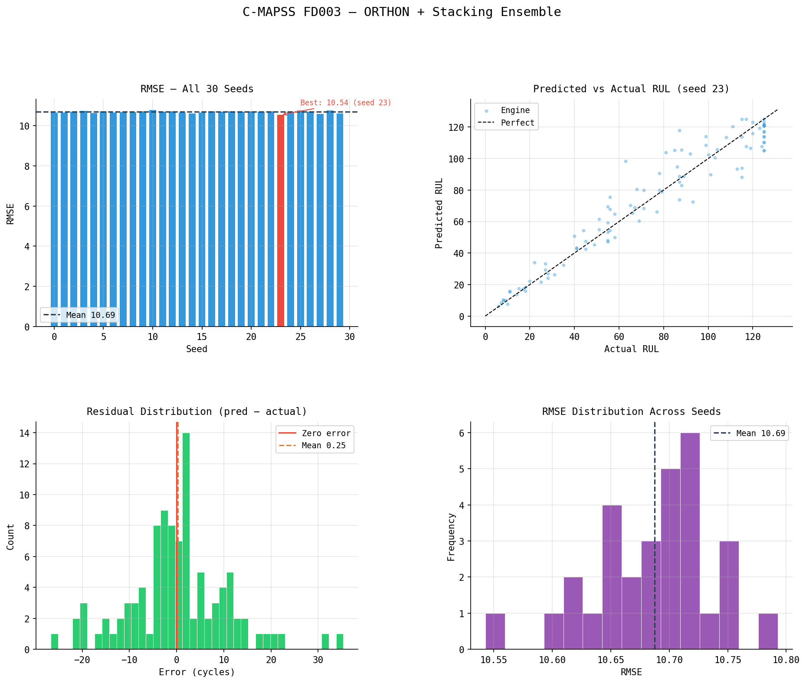
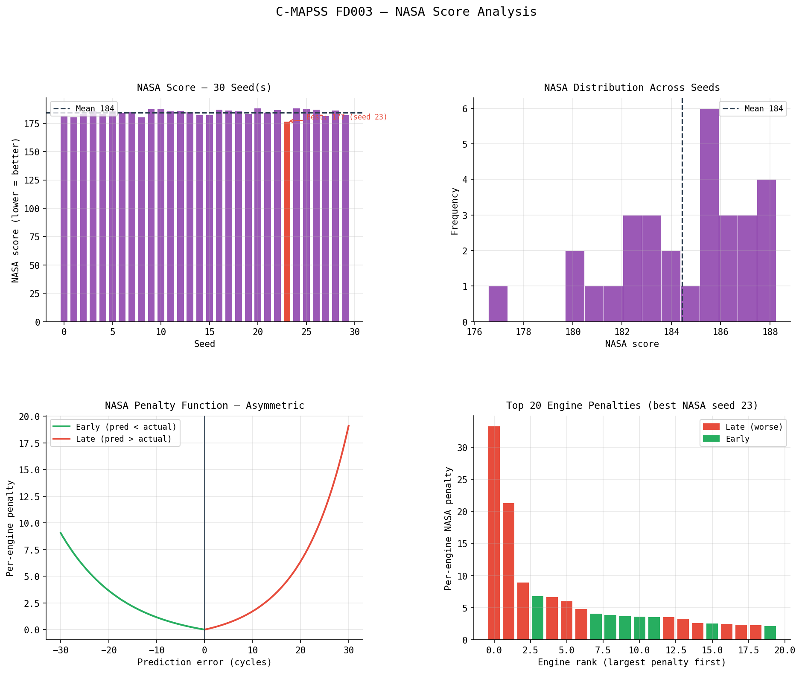
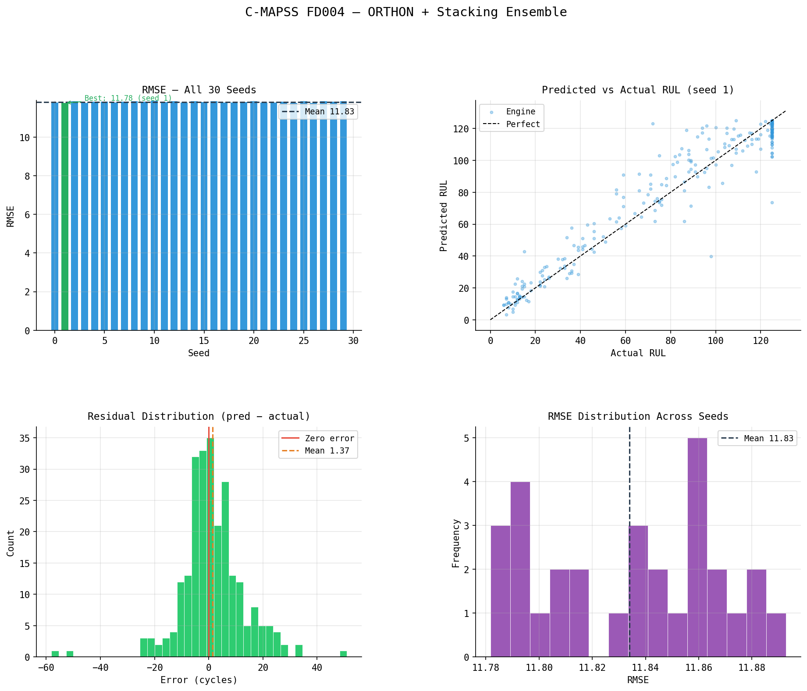
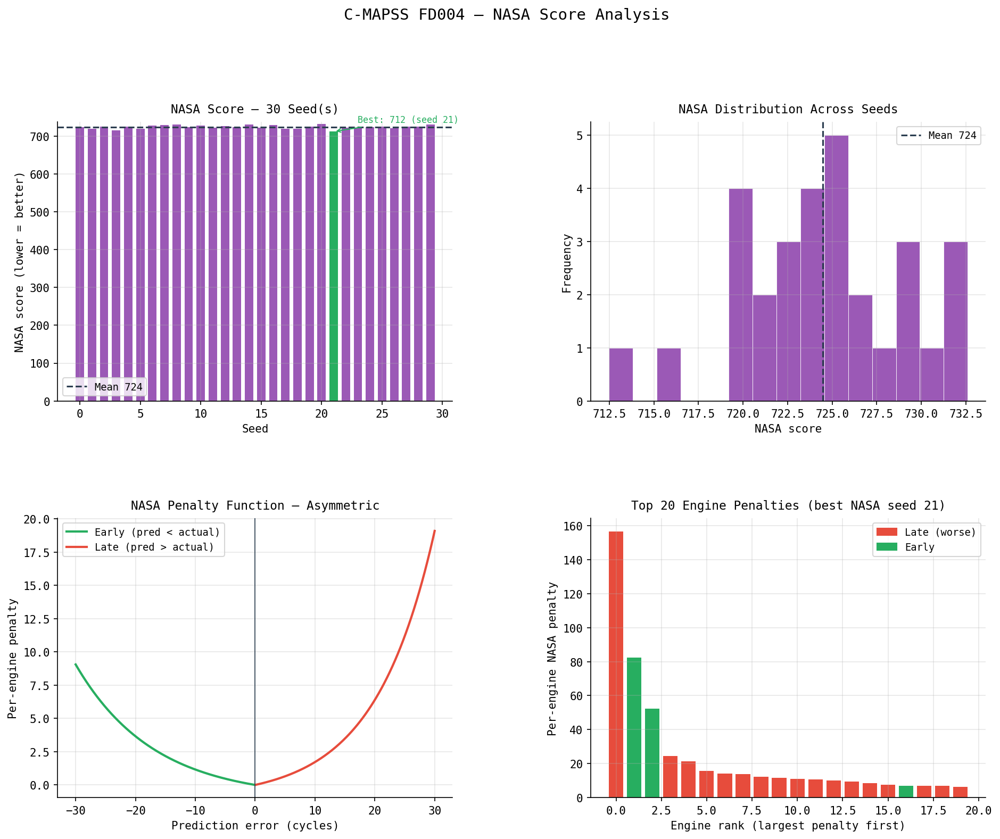

# C-MAPSS

Reproduce C-MAPSS turbofan engine RUL prediction results.

Pre-computed feature matrices with anonymized columns. No feature engineering
code — load, train, score.

## Quick Start

```bash
git clone https://github.com/orthon-io/cmapss.git
cd cmapss
pip install -r requirements.txt
PYTHONHASHSEED=0 python run.py --dataset fd001 --seed 0
```

## Headline Results (30-seed validated)

| Dataset | RMSE mean±std | NASA mean±std | Gap | Features |
|---------|--------------|--------------|-----|----------|
| **FD001** | **10.31 ± 0.06** | **143.7 ± 1.7** | 1.14x | 88  |
| **FD002** | **12.90 ± 0.04** | **543.0 ± 4.1** | 0.78x | 275 |
| **FD003** | **10.69 ± 0.05** | **184.4 ± 2.8** | 0.93x | 149 |
| **FD004** | **11.83 ± 0.03** | **724.5 ± 4.9** | 0.93x | 157 |

See `RESULTS.md` for full statistics, error tails, and methodology.

## Reproduce a Single Result

```bash
PYTHONHASHSEED=0 python run.py --dataset fd001 --seed 0
# → RMSE 10.38, NASA 144, gap 1.13x
```

`PYTHONHASHSEED=0` must be set in the shell before Python starts — the
assignment inside `run.py` is a no-op because Python reads the variable
at interpreter startup. This, together with `n_jobs=1` and
`deterministic=True` on the GBM base learners, pins every run of the
same seed to bit-identical predictions.

## 30-Seed Sweep

```bash
PYTHONHASHSEED=0 python run.py --dataset fd001 --seeds 0-29
```

Reports mean ± std for RMSE, NASA, gap ratio, and aggregate error tails.

## Visual Quick-Look

Per-dataset Jupyter notebooks with the full 30-seed sweep and plots
cached inline (GitHub renders them):

- [notebooks/fd001.ipynb](notebooks/fd001.ipynb)
- [notebooks/fd002.ipynb](notebooks/fd002.ipynb)
- [notebooks/fd003.ipynb](notebooks/fd003.ipynb)
- [notebooks/fd004.ipynb](notebooks/fd004.ipynb)

Each notebook reproduces its dataset's row in the headline table and
shows the RMSE distribution across 30 seeds, predicted-vs-actual RUL,
residuals, and the NASA penalty per engine.

| Dataset | RMSE distribution | NASA score |
|---------|-------------------|------------|
| FD001 |  |  |
| FD002 |  |  |
| FD003 |  |  |
| FD004 |  |  |

## Datasets

Each dataset directory contains two parquet files:

- `train.parquet` — feature matrix (cohort, F001..FNNN, RUL)
- `test.parquet` — last cycle per engine (cohort, F001..FNNN, RUL)

| Dataset | Train Engines | Test Engines | Operating Conditions | Fault Modes |
|---------|--------------|-------------|---------------------|-------------|
| FD001 | 100 | 100 | 1 | 1 (HPC) |
| FD002 | 260 | 259 | 6 | 1 (HPC) |
| FD003 | 100 | 100 | 1 | 2 (HPC + Fan) |
| FD004 | 249 | 248 | 6 | 2 (HPC + Fan) |

The feature matrices are post-imputation, post-scaling. The researcher
loads them directly — no feature engineering, no imputation, no scaling
required.

Raw data source: [NASA C-MAPSS](https://data.nasa.gov/dataset/cmapss-jet-engine-simulated-data)

## Method

- **Model:** Stacking ensemble — LightGBM + XGBoost + HistGradientBoosting → RidgeCV
- **Validation:** 5-fold GroupKFold on engine ID (no leakage across engines)
- **Target:** RUL capped at 125 cycles (C-MAPSS standard)
- **Scoring:** RMSE + NASA PHM08 asymmetric penalty
- **No hyperparameter tuning.** Same architecture across all four datasets.
- **Deterministic:** `random_state=seed` on every base model, `n_jobs=1`
  and `deterministic=True` on LightGBM/XGBoost to eliminate thread-count
  variance. Invoke with `PYTHONHASHSEED=0` in the shell for full
  bit-identity across runs on the same stack.

For multi-operating-condition datasets (FD002, FD004), a physics-based
operating condition correction is applied at data ingestion. The pre-computed
feature matrices in this repository are derived from the corrected data.

## Leakage Audit

`run.py` automatically prints the maximum feature-target correlation before
training. All datasets fall within healthy bounds (max |corr| ≤ 0.89,
gap ratios 0.78–1.14x).

## Requirements

- Python 3.10+
- numpy, polars, scikit-learn, xgboost, lightgbm, pyarrow

## License

[CC BY-NC 4.0](LICENSE.md) — non-commercial use with attribution.
**Patent Pending** — patent rights are expressly reserved; commercial use
requires a separate written license from the copyright holder.

The feature engineering pipeline that produced the F001..FNNN columns is
not included in this repository. Researchers can verify the reported results
exactly using the provided feature matrices and `run.py`.
